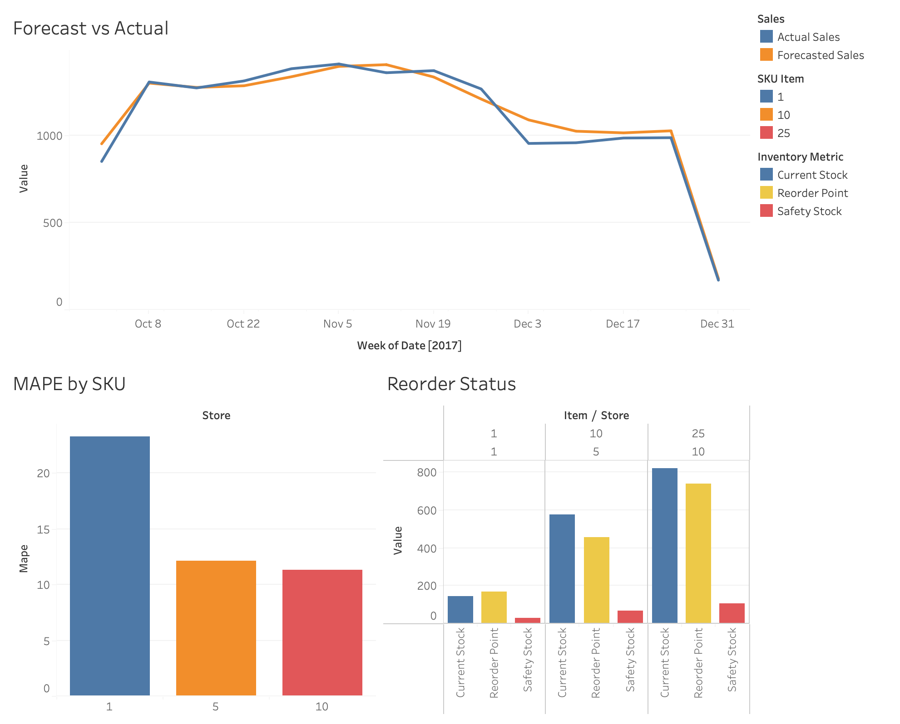

# RetailStock Demand Forecaster & Safety-Stock Planner

Forecasts SKU-level retail demand and turns that into real inventory decisions - safety stock levels and reorder points - using a real 5-year, 10-store, 50-item daily sales dataset.

## Problem
Retailers have to balance two costs: running out of stock and losing sales, or holding too much and tying up capital in storage. Getting this right means knowing not just what demand looks like on average, but how much it swings, since that's what actually determines how big a safety buffer you need. This project builds the full pipeline - raw sales data, a forecast, an inventory policy that accounts for uncertainty, and a dashboard an ops team could realistically use.

## Approach
1. EDA - cleaned and explored 913K rows of daily sales across 10 stores and 50 items, pulled per-SKU demand stats (mean, std dev)
2. Forecasting - trained Prophet models per SKU to capture weekly and yearly seasonality, evaluated on a held-out 90-day window using MAPE and bias
3. Inventory policy - calculated safety stock (Z-score x demand std dev over lead time) and reorder points for all 500 SKUs, assuming a 7-day lead time and 95% service level
4. Dashboard - built an interactive Tableau dashboard showing forecast accuracy and flagging which SKUs are below their reorder point

## Results
| SKU | MAPE |
|---|---|
| Store 1, Item 1 | ~23% |
| Store 5, Item 10 | ~12% |
| Store 10, Item 25 | ~11.3% |

(pulled from the dashboard - check forecast_metrics.csv for exact numbers)

## Dashboard

Live version: [Tableau Public]
(https://public.tableau.com/views/RetailStockDemandandReplenishmentDashboard/RetailstockDemandReplenishmentDashboard?:language=en-GB&publish=yes&:sid=&:redirect=auth&:display_count=n&:origin=viz_share_link)

## Tech stack

**Data processing & analysis**
- Python
- pandas, NumPy - data cleaning, aggregation, per-SKU demand statistics
- SciPy - Z-score calculation (norm.ppf) for safety stock

**Forecasting**
- Prophet - time series forecasting per SKU, captures weekly and yearly seasonality
- scikit-learn - train/test evaluation utilities

**Visualization**
- Matplotlib, Seaborn - EDA plots, forecast vs. actual charts (in-notebook)
- Tableau Public - final interactive dashboard

**Tooling**
- Jupyter Notebook - development environment
- openpyxl - Excel export for Tableau data source
- Git / GitHub - version control

## Repo structure
- 01_eda.ipynb - data exploration and demand statistics
- 02_forecasting.ipynb - Prophet models and MAPE/bias evaluation
- 03_safety_stock.ipynb - safety stock and reorder point calculations
- 04_dashboard_export.ipynb - preps data for Tableau
- data/raw/ - source Kaggle dataset
- data/processed/ - model outputs, dashboard-ready files
- assets/ - dashboard screenshot
- requirements.txt

## How to run
git clone https://github.com/thaenandarhtet-iris/retailstock-demand-forecaster.git
cd retailstock-demand-forecaster
python3 -m venv venv
source venv/bin/activate
pip install -r requirements.txt
jupyter notebook

Run the notebooks in order: 01_eda.ipynb, then 02_forecasting.ipynb, then 03_safety_stock.ipynb, then 04_dashboard_export.ipynb

## Data source
Kaggle: Store Item Demand Forecasting Challenge - https://www.kaggle.com/competitions/demand-forecasting-kernels-only

## Notes
The current stock numbers in the reorder-status dashboard are simulated for the demo since there's no live inventory feed. The reorder points and safety stock themselves come straight from real historical demand.
